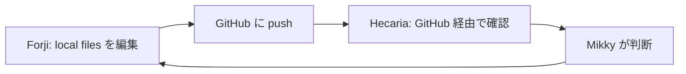
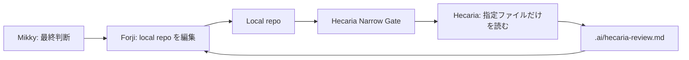

# Hecaria Narrow Gate 設計方針

## 目的

Hecaria Narrow Gate は、Hecaria が ChatGPT ワークスペース上の過去アップロードファイルを参照せず、ローカルリポジトリの現在状態だけを読むための仕組みである。

現在の課題は、ファイルを ChatGPT にアップロードすると、そのファイルがワークスペース側に残り続けることにある。  
その結果、Hecaria が最新版を見に行ったつもりでも、過去にアップロードされた古いファイルを参照してしまう可能性がある。

この問題は「古いファイルを見ないで」とルールで制御するのではなく、そもそも古いファイルが Hecaria の視界に入らない設計で解決する。

## 基本方針

Single source of truth はローカルリポジトリとする。

Hecaria は ChatGPT ワークスペース上のファイルを見ない。  
Hecaria は GitHub に push されたファイルを前提にしない。  
Hecaria は CLI または MCP を通じて、指定されたローカルファイルだけを読む。

つまり、Hecaria に「最新版だけを見て」と頼むのではなく、Hecaria が最新版以外を見られない小部屋を用意する。

## 現在の問題構造

現在の流れは次の通り。



この流れでは、Hecaria がローカルの現在状態を直接見られない。  
また、ChatGPT にファイルをアップロードして共有する場合、過去ファイルがワークスペースに残り、参照先が混ざる危険がある。

## 目指す構造

目指す構造は次の通り。



Hecaria Narrow Gate は、Hecaria に渡す情報をローカル側で明示的に選ぶ。  
Hecaria は、渡された情報以外を見られない。

## 設計原則

| 原則 | 内容 |
|---|---|
| Local repo is the source of truth | 正本はローカルリポジトリ |
| No ChatGPT file upload | 通常運用では ChatGPT へのファイルアップロードを使わない |
| Narrow context | Hecaria に渡すファイルを毎回明示する |
| No global search | 過去アップロードや無関係ファイルを検索対象にしない |
| Read-only Hecaria | Hecaria は設計レビュー・方針整理・構造確認を担当する |
| Forji writes | 実装・ファイル編集・git操作は Forji が担当する |
| Mikky decides | 最終判断と承認は Mikky が行う |
| Start small | 最初は API + 小さい CLI で始め、必要なら MCP 化する |

## 役割分担

| 役割 | 担当 | 権限 |
|---|---|---|
| Mikky | 目的設定・判断・承認 | 最終決定 |
| Hecaria | 設計レビュー・方針整理・文脈整理 | read only |
| Forji | 実装・修正・テスト・git操作 | write / test / git |
| Hecaria Narrow Gate | Hecaria に渡す情報の制御 | selected files / diff only |

## MVP

最初に作るものは、OpenAI API を使った小さい CLI とする。  
MCP は最初から必須にしない。

### コマンド例

```bash
hecaria review \
  --files story_card/story-design.md story_card/story-card-template.md \
  --diff \
  --question "Check whether the Story Card template matches the Story design."
```

### CLI が行うこと

| 処理 | 内容 |
|---|---|
| branch確認 | `git rev-parse --abbrev-ref HEAD` |
| commit確認 | `git rev-parse HEAD` |
| 状態確認 | `git status --short` |
| 指定ファイル読み込み | `--files` で指定されたファイルだけ読む |
| diff確認 | `--diff` が指定された場合だけ `git diff` を読む |
| API送信 | Hecaria 用プロンプトと指定ファイルを OpenAI API に送る |
| レビュー保存 | `.ai/hecaria-review.md` に保存する |

## Hecaria に渡す入力

Hecaria には、次の情報だけを渡す。

```md
# Workspace Snapshot

- repo:
- branch:
- commit:
- working tree status:
- requested files:
- generated_at:

# User Question

# Selected Files

# Current Diff
```

ここで重要なのは、`Selected Files` に含まれるものだけが Hecaria の参照対象になること。  
過去アップロード済みファイル、ChatGPT ワークスペース、無関係なローカルファイルは渡さない。

## Hecaria の出力

Hecaria の出力は、ローカルの `.ai/hecaria-review.md` に保存する。

```md
# Hecaria Review

## Verdict

## Design Concerns

## Minimal Changes

## Questions for Mikky

## Message to Forji
```

これにより、Forji は Hecaria のレビューをローカルで読める。  
GitHub push やファイルアップロードを経由しなくてよい。

## ディレクトリ構成案

```text
tools/hecaria/
  hecaria-review.ts
  prompt.ts
  file-loader.ts
  git-context.ts

.ai/
  hecaria-review.md
```

`.ai/` は作業メモなので、基本的には `.gitignore` に入れる。

```gitignore
.ai/
```

必要ならテンプレートだけ管理する。

```text
.ai-template/
  hecaria-review.template.md
  forji-report.template.md
```

## API と MCP の位置づけ

### Phase 1: OpenAI API + CLI

最初は OpenAI API とローカル CLI だけでよい。

理由は、Hecaria に渡すファイルをアプリ側で明示的に選べるから。  
「そこしか見てない」設計にしやすい。

### Phase 2: MCP 化

ツールが増えてきたら MCP 化する。

MCP 化する場合も、Hecaria に広い権限を渡さない。  
あくまで selected files / git diff / git status 程度に絞る。

### Phase 3: AI Court Relay

将来的には、Hecaria・Forji・Mikky のやりとりをローカルで統合する。

```text
ai-court ask-hecaria
ai-court ask-forji
ai-court council
```

ただし、自動で長時間議論させるのではなく、Mikky が司会として判断する。

## MCP 化する場合のツール権限

| Tool | 許可 | 理由 |
|---|---:|---|
| `read_selected_files` | OK | 指定ファイルだけ読む |
| `git_status` | OK | 現在状態を確認する |
| `git_diff` | OK | 未コミット差分を見る |
| `write_review` | OK | `.ai/hecaria-review.md` に保存する |
| `search_files` | 要検討 | 範囲を限定すれば可 |
| `write_project_file` | 原則なし | 実装変更は Forji が担当 |
| `git_commit` | なし | 最終判断前にcommitしない |
| `git_push` | なし | pushはMikkyまたはForjiの明示操作 |
| `run_shell` | なし | 権限が広すぎる |

## なぜ通常の ChatGPT UI ではなく CLI なのか

通常の ChatGPT UI は、ファイルアップロードによって参照候補が増えていく。  
過去ファイルが残り、検索や文脈の中に混ざる可能性がある。

この問題をルールで完全に防ぐのは難しい。

CLI 方式では、Hecaria に渡すファイルをローカル側で明示的に選ぶ。  
Hecaria はその API 呼び出しに含まれる情報しか見ない。

つまり、古いファイルを無視するのではなく、古いファイルが存在しない入力空間を作る。

## 運用ルール

### 原則

- ChatGPT へのファイルアップロードは通常運用では使わない
- Hecaria への入力は CLI が生成する
- Hecaria はレビューを書く
- Forji はレビューを読んで実装する
- Mikky が最終判断する

### レビューの流れ

1. Forji がローカルファイルを編集する
2. Mikky が Hecaria に見せたいファイルを指定する
3. `hecaria review` を実行する
4. Hecaria が `.ai/hecaria-review.md` を生成する
5. Forji がレビューを読んで修正する
6. Mikky が確認する
7. 必要に応じて commit / push する

## 最初に作るもの

v0 では、次の機能だけでよい。

| 機能 | 内容 |
|---|---|
| selected file reader | 指定ファイルだけ読む |
| git context reader | branch / commit / status を読む |
| diff reader | `--diff` 指定時だけ差分を読む |
| OpenAI API caller | Hecaria prompt と入力を送る |
| review writer | `.ai/hecaria-review.md` に保存する |

## 非目標

v0 では次のことはしない。

- Hecaria にプロジェクト全体を自由検索させない
- Hecaria にファイルを書き換えさせない
- Hecaria に git commit / push させない
- AI同士を自動で何往復も議論させない
- ChatGPT ワークスペースのファイルを使わない

## まとめ

Hecaria Narrow Gate は、Hecaria を「広いワークスペースにいるAI」ではなく、「指定された現在ファイルだけを見るローカルレビュー担当」として動かすための仕組みである。

目的は、Hecaria に最新版を見てもらうことではない。  
目的は、Hecaria が最新版以外を見られない設計にすること。

そのために、最初は OpenAI API + 小さい CLI で始める。  
必要になったら MCP 化する。

Hecaria は読む。  
Forji は作る。  
Mikky は決める。
